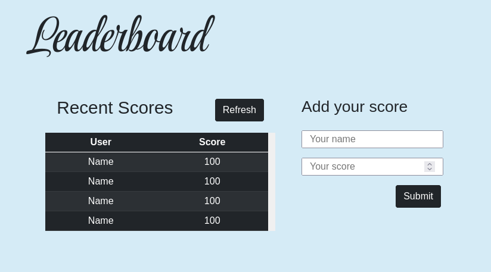

<p align="center">
  <a href="https://www.microverse.org/">
    
  </a>
  <a href="https://github.com/enionsouza/leaderboard/blob/develop/LICENSE">
    
  </a>
  <a href="https://github.com/enionsouza/leaderboard">
    
  </a>
  <a href="https://github.com/enionsouza/leaderboard">
    
  </a>
</p>

# Leaderboard
The leaderboard website displays scores submitted by different players. It also allows you to submit your score. All data is preserved thanks to the external Leaderboard API service.



## Built With

- HTML, CSS, JavaScript, & Webpack
- Visual Studio, Git, & GitHub

## Pre-requisites

- NodeJs (v. 14.17)
- Git

## Live Demo

A live demo for this project can be found in [this link](https://enionsouza.github.io/leaderboard/dist/).

## Getting Started

To run this project, you only need a computer with a browser installed, and follow these steps:

1. In your terminal, in the folder of your preference, type the following bash command to clone this repository:

```sh
git clone git@github.com:enionsouza/leaderboard.git
```

2. Now that you have already cloned the repo, run the following commands to get the project up and running:
```sh
cd leaderboard
npm install
npm start
```

3. Next, you can start editing this template from the files provided in the `/src` folder. All the changes will be automatically updated on your local server on http://localhost:8080/. You can stop your local server at any time hitting `<Ctrl> + C` on your keyboard.

## Author

👤 **Ênio Neves de Souza**

- GitHub: [@enionsouza](https://github.com/enionsouza)
- Twitter: [@enionsouza](https://twitter.com/enionsouza)
- LinkedIn: [Enio Neves de Souza](https://www.linkedin.com/in/enio-neves-de-souza/)

## 🤝 Contributing

Contributions, issues, and feature requests are welcome!

Feel free to check the [issues page](https://github.com/enionsouza/leaderboard/issues).

## Show your support

Give a ⭐️ if you like this project!

## 📝 License

This project is [MIT](./LICENSE) licensed.
